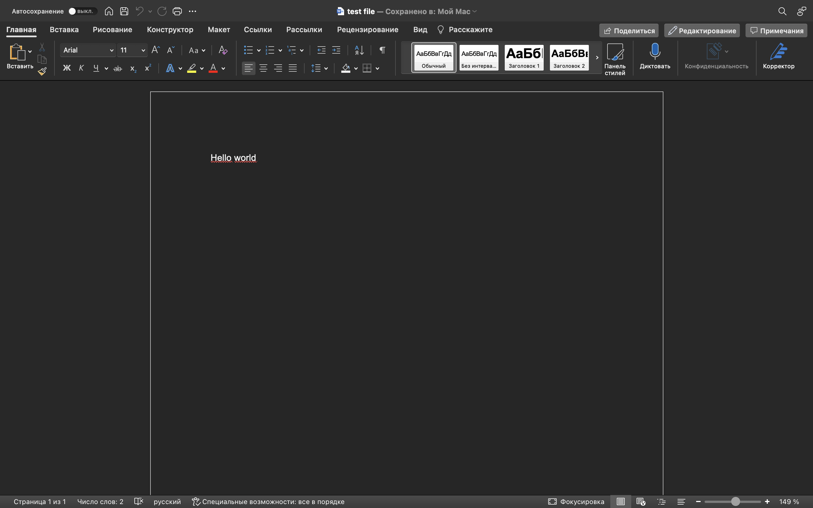

# Проект Drive Project

### Описание
В этом проекте представлены API методы для создания и скачивания, созданного документа на платформе:
**_Ссылка на [платформу](https://drive.google.com/ "Гиперссылка к платформе.")_**
**_Ссылка на документацию к [API](https://driveproject.pythonanywhere.com/api/redoc/ "Гиперссылка к API.") с актуальными адресами. Здесь описана структура возможных запросов и ожидаемых ответов_**


### Технологии
- Python 3.10
- Django 4.2.7
- Djangorestframework 3.14.0

### Используемые модули
- google-api-python-client 2.108.0
- google-auth 2.23.4
- google-auth-oauthlib 1.1.0
- google-auth-httplib2 0.1.1
- urllib 2.1.0
- drf-yasg 1.21.7

### Как запустить и протестировать проект:

Клонировать репозиторий и перейти в него в командной строке:

```
git clone git@github.com:OlegMusatov3000/driveproject.git
```

```
cd driveproject
```

Cоздать виртуальное окружение:

- Команда для Windows

```
python -m venv venv
```

- Для Linux и macOS:

```
python3.10 -m venv venv
```

Активировать виртуальное окружение:

- Команда для Windows:

```
source venv/Scripts/activate
```

- Для Linux и macOS:

```
source venv/bin/activate
```

Установить зависимости из файла requirements.txt:

```
python -m pip install --upgrade pip
```

```
pip install -r requirements.txt
```

Перейти в папку с файлом manage.py:

```
cd mydriveproject
```

Запустить проект (если хотите протестировать локально):

```
python manage.py runserver
```

Создать новое окно терминала, снова активировать виртуальное окружение (если выполняли команду runserver) и выполнить команду в директории с файлом manage.py:

```
python manage.py create_new_document
```

В командной строчке вас попросят последовательно ввести требуемое название документа и его содержание. Например:

```
Введите название документа: test_file
```
```
Введите содержание документа: Hello world
```

В ответ вы получите уникальный идентифика́тор документа который был создан, а также ссылку для скачивания документа. Например:

```
Уникальный идентификатор: 1T79yWi_zXHGTJN3uF0e90X_BELgRf4Yh0FNkkwih7ng

Используйте его для скачивания документа по адресу:

https://driveproject.pythonanywhere.com/api/download_document/1T79yWi_zXHGTJN3uF0e90X_BELgRf4Yh0FNkkwih7ng
```

Начнется скачивание документа в формате docx с именем и содержанием которое вы указали ранее. Например:
- 

### Небольшое примечание
Этот readme был написан для удобного и понятного тестирования проекта. Пожалуйста оцените мои старания и предоставьте обратную связь в TG что можно было бы улучшить и чего не хватает для удовлетвория ваших ожиданий
- Tg: @OlegMusatov

### Автор проекта 
- Олег Мусатов
- Tg: @OlegMusatov